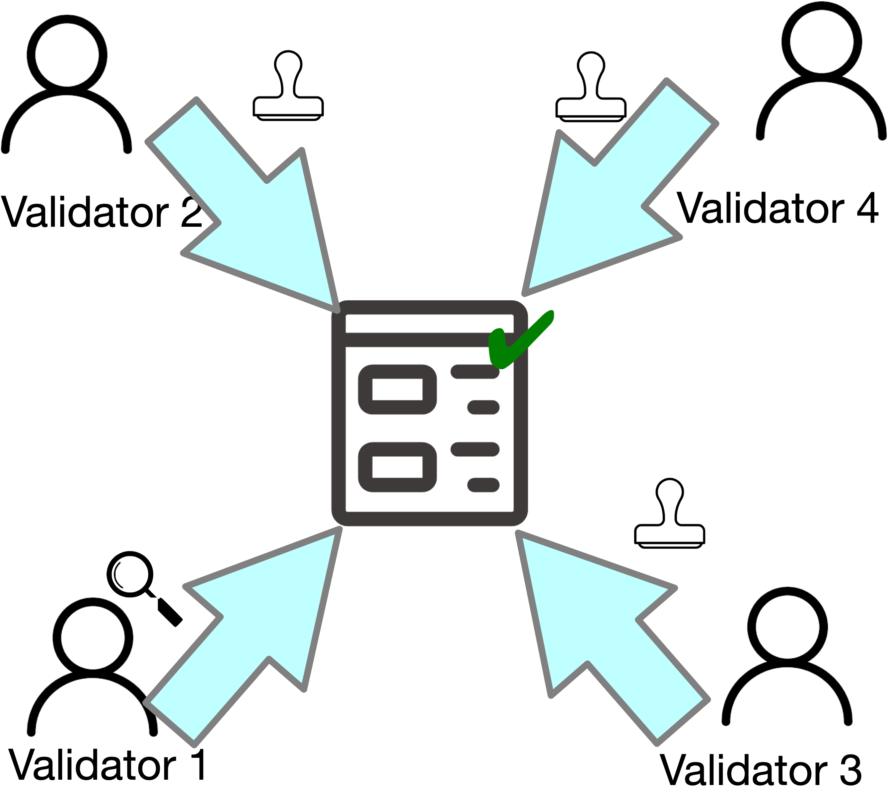

# Joltify Chain Bridge

To allow the token transfer from and to one public chain (for example, Ethereum chain or Binance smart chain) to Joltify chain, cross-chain bridges are deployed to allow users to send and receive the token in bi-direction.

### Transferring Token From Public Chain To Joltify Chain

1. User Alice transfers her token to the bridge router on the public chain end.
2. Once the Joltify chain validator observes the transfer to the given bridge router end, it will mint the corresponding amount of wrapped tokens to the user’s corresponding Joltify chain address.

### Transferring Tokens From Joltify Chain To Public Chain

1. User Bob transfers his token to the bridge router on the Joltify chain end.
2. Once the Joltify chain validator observes the transfer to the given bridge router end, it will transfer the corresponding token to Bob address on the public chain.
3. Once the transfer transaction is confirmed on the public chain, the wrapped token is minted in Joltify chain will then be burned.

### Bridging Transaction Verification and Signing

The security of the Joltify bridge has the highest priority as it holds liquidity from both ends. To avoid any validator cheating the system by sending illegal transactions, we apply the TSS to ask a certain amount of validators to sign on the outbound transactions. Since the majority of the nodes in the network are honest, it is not possible for the attackers to sign the outbound transactions without permission from the majority.

The following figure shows how the validators sign an out-bound transaction.

1. Different validators monitor the Joltify chain bridge router independently. Once they see a transaction coming to the Joltify chain bridge router, they will verify the validity of the transaction.
2. If the transaction is invalid, they will drop the transaction, otherwise, they will start a TSS signature generation rounds with other validators on the corresponding transaction.
3. Other validators will participate in the signature generation as well, and finally, all the validators will get the signature of the corresponding transaction and put the corresponding transaction on Joltify Chain.
4. If the transaction is an inbound transaction, the equivalent token will be minted on the Joltify chain. If it is the outbound transaction, the token will then be transferred to the user's wallet with the approval of the validators.

###
